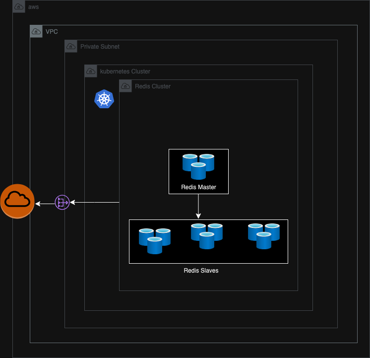

# Redis Kubernetes CI/CD (redis-k8s-cicd)

## Architecture Diagram

## Overview
This project automates the deployment of a scalable and resilient Redis cluster on Kubernetes using Helm, along with Terraform for infrastructure provisioning. It integrates a CI/CD pipeline to allow seamless updates and zero downtime for the Redis deployment.

### Key Technologies:
- **Terraform:** Infrastructure as code for managing Kubernetes clusters and cloud resources.
- **Helm:** Package manager for Kubernetes applications.
- **Kubernetes:** Orchestrating containerized applications.
- **Redis:** In-memory data structure store.

---

## Infrastructure Provisioning (Terraform)

### Files:
- `main.tf`: Main configuration to provision the Kubernetes cluster (e.g., EKS, GKE, or AKS).
- `modules/eks`: Defines the resources for the Kubernetes cluster.
- `modules/vpc`: Configures networking.
- `modules/iam`: Manages access control and roles.

### Setup Process:
1. **Backend Configuration (`backend.tf`):** Defines the storage for Terraform state (e.g., S3, Azure Blob).
2. **Infrastructure Components:**
   - The Kubernetes cluster is provisioned with the necessary compute and networking infrastructure.
   - IAM roles and policies ensure secure access to cluster resources.

### Variables:
- Configurable via `variables.tf`, allowing flexibility in setting parameters like region, node size, and replica count.

---

## Kubernetes Deployment (Helm)

### Redis Helm Chart:
- `helm/redis/`: This directory contains the Helm chart for deploying Redis with considerations for high availability, monitoring, and scaling.

### Key Files:
- **`Chart.yaml`**: Metadata for the Redis chart.
- **`values.yaml`**: Configuration settings such as replicas, resource limits, Redis-specific settings.
- **`templates/`:** Contains Kubernetes resource definitions:
  - **StatefulSets** for managing Redis instances.

### Scaling & Resilience:
- Redis is deployed using StatefulSets for persistence and high availability.

---

## CI/CD Pipeline

### Objective:
- Automate the deployment and management of the Redis cluster, ensuring zero-downtime updates.

### Pipeline Workflow:
1. Code changes are committed to a Git repository.
2. Helm is used to apply changes to the Kubernetes cluster with `helm upgrade`.
3. The pipeline ensures rolling updates to Redis without causing any service interruptions.

### Zero-Downtime Features:
- Helm’s rolling update strategy and StatefulSet updates help maintain service availability.

---

## Conclusion
This project successfully deploys a Redis cluster on Kubernetes, fully automated through Helm and Terraform. It leverages CI/CD for efficient and zero-downtime updates.
